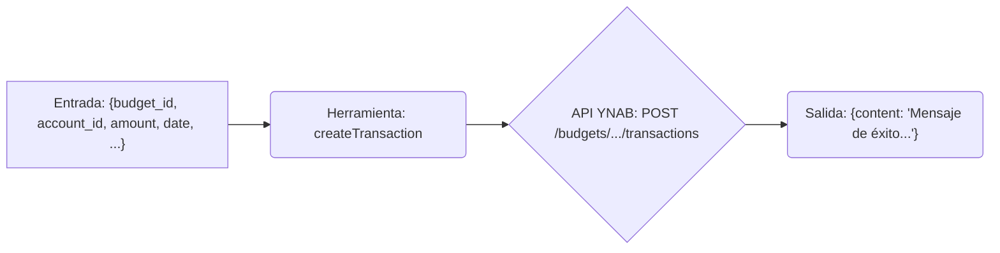

# Herramienta: createTransaction

## Propósito y Contexto de Uso

Crea una nueva transacción en un presupuesto y cuenta especificados.

Esta herramienta permite añadir nuevas entradas de gasto o ingreso a YNAB. Requiere el `budgetId` y `accountId` donde la transacción debe ser registrada, junto con los detalles de la transacción como `amount`, `date`, y opcionalmente `payee_name`, `category_id` y `memo`.

Los IDs para `budgetId`, `accountId`, y `categoryId` pueden obtenerse usando las herramientas `list...` respectivas.

## Argumentos Clave

*   `budget_id` (string, requerido): El ID del presupuesto.
*   `account_id` (string, requerido): El ID de la cuenta para la transacción.
*   `amount` (number, requerido): La cantidad de la transacción en **milliunits** (p.ej., $12.34 es 12340). Usa valores negativos para salidas (gastos) y positivos para entradas (ingresos).
*   `date` (string, requerido): La fecha de la transacción en formato `YYYY-MM-DD`.
*   `payee_name` (string, opcional): El nombre del beneficiario (máx 50 caracteres).
*   `category_id` (string, opcional): El ID de la categoría a asignar.
*   `memo` (string, opcional): Una nota para la transacción (máx 200 caracteres).
*   `cleared` (string, opcional): `cleared` (compensado), `uncleared` (no compensado), o `reconciled` (conciliado).
*   `approved` (boolean, opcional): Si la transacción está aprobada.

## Salida Clave

Devuelve un mensaje de confirmación en caso de éxito, incluyendo el ID de la transacción recién creada.

*   `content`: Mensaje de texto como `"Transaction created successfully. ID: <id_nueva_transaccion>"`

## Flujo Simplificado

