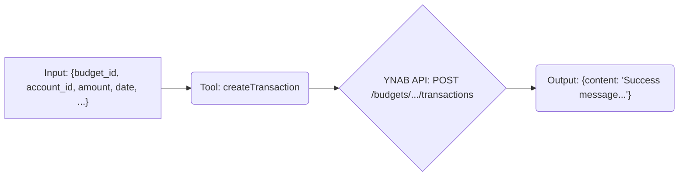

# Tool: createTransaction

## Purpose & Usage Context

Creates a new transaction in a specified budget and account.

This tool allows adding new spending or income entries to YNAB. It requires the `budgetId` and `accountId` where the transaction should be recorded, along with the transaction details like `amount`, `date`, and optionally `payee_name`, `category_id`, and `memo`.

IDs for `budgetId`, `accountId`, and `categoryId` can be obtained using the respective `list...` tools.

## Key Arguments

*   `budget_id` (string, required): The ID of the budget.
*   `account_id` (string, required): The ID of the account for the transaction.
*   `amount` (number, required): The transaction amount in **milliunits** (e.g., $12.34 is 12340). Use negative values for outflows (spending) and positive values for inflows (income).
*   `date` (string, required): The date of the transaction in `YYYY-MM-DD` format.
*   `payee_name` (string, optional): The name of the payee (max 50 chars).
*   `category_id` (string, optional): The ID of the category to assign.
*   `memo` (string, optional): A note for the transaction (max 200 chars).
*   `cleared` (string, optional): `cleared`, `uncleared`, or `reconciled`.
*   `approved` (boolean, optional): Whether the transaction is approved.

## Key Output

Returns a confirmation message upon success, including the ID of the newly created transaction.

*   `content`: Text message like `"Transaction created successfully. ID: <new_transaction_id>"`

## Simplified Flow

