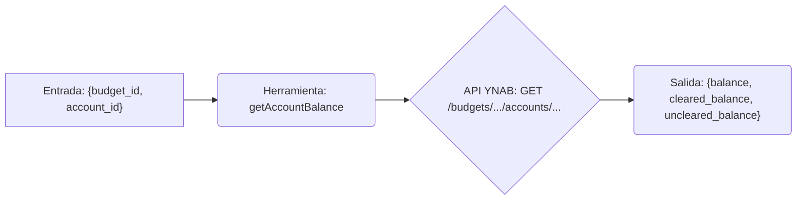

# Herramienta: getAccountBalance

## Propósito y Contexto de Uso

Obtiene los detalles del saldo actual (total, compensado, no compensado) para una *única* cuenta específica dentro de un presupuesto dado.

Esta herramienta se usa típicamente *después* de obtener una lista de cuentas usando `listAccounts` para obtener el `accountId` específico que te interesa. Permite recuperar información actualizada del saldo para una cuenta sin necesidad de obtener la lista completa de nuevo.

## Argumentos Clave

*   `budget_id` (string, requerido): El identificador del presupuesto que contiene la cuenta.
*   `account_id` (string, requerido): El identificador de la cuenta específica a consultar.

## Salida Clave

Devuelve un único objeto que contiene la información del saldo para la cuenta solicitada:

*   `balance` (number): El saldo total actual.
*   `cleared_balance` (number): El saldo que incluye solo transacciones compensadas.
*   `uncleared_balance` (number): El saldo que incluye solo transacciones no compensadas.

*(Todos los saldos están en formato milliunits).*

## Flujo Simplificado

