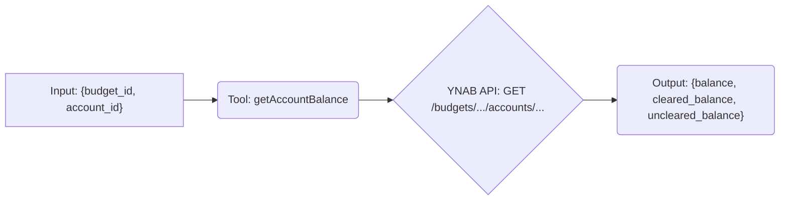

# Tool: getAccountBalance

## Purpose & Usage Context

Fetches the current balance details (total, cleared, uncleared) for a *single*, specific account within a given budget.

This tool is typically used *after* obtaining a list of accounts using `listAccounts` to get the specific `accountId` you are interested in. It allows retrieving up-to-date balance information for one account without fetching the entire list again.

## Key Arguments

*   `budget_id` (string, required): The identifier of the budget containing the account.
*   `account_id` (string, required): The identifier of the specific account to query.

## Key Output

Returns a single object containing the balance information for the requested account:

*   `balance` (number): The current total balance.
*   `cleared_balance` (number): The balance including only cleared transactions.
*   `uncleared_balance` (number): The balance including only uncleared transactions.

*(All balances are in milliunits format).*

## Simplified Flow

