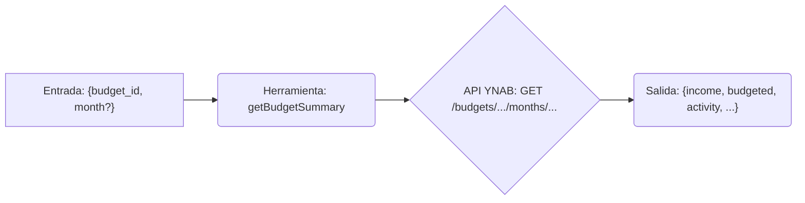

# Herramienta: getBudgetSummary

## Propósito y Contexto de Uso

Obtiene un resumen de la actividad del presupuesto (ingresos, cantidad presupuestada, actividad de gasto) para un mes específico dentro de un presupuesto dado.

Esta herramienta es útil para obtener una visión general del rendimiento de un presupuesto en un mes particular. Típicamente requiere un `budgetId` (obtenible de `listBudgets`) y opcionalmente un `month` específico.

## Argumentos Clave

*   `budget_id` (string, requerido): El identificador del presupuesto a resumir.
*   `month` (string, opcional): El mes para obtener el resumen (formato ISO 8601, p.ej., `YYYY-MM-DD`). Por defecto es el mes actual si no se proporciona.

## Salida Clave

Devuelve un único objeto que contiene los datos de resumen para el mes solicitado:

*   `income` (number): Ingresos totales del mes.
*   `budgeted` (number): Cantidad total presupuestada para el mes.
*   `activity` (number): Actividad total de gasto para el mes.
*   `to_be_budgeted` (number): Cantidad disponible para presupuestar.
*   `age_of_money` (number | null): Edad del dinero en días.

*(Todas las cantidades monetarias están en formato milliunits).*

## Flujo Simplificado

