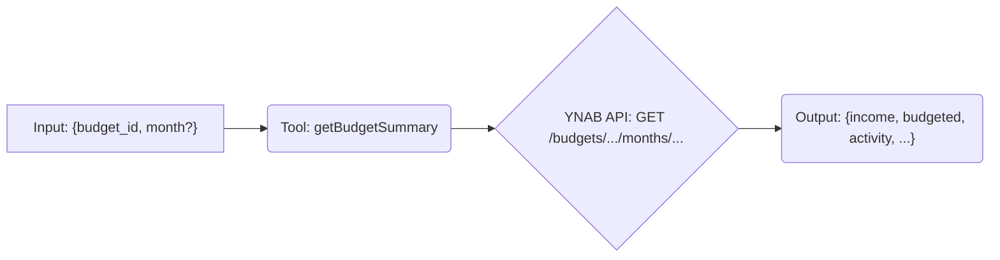

# Tool: getBudgetSummary

## Purpose & Usage Context

Fetches a summary of budget activity (income, budgeted amount, spending activity) for a specific month within a given budget.

This tool is useful for getting a high-level overview of a budget's performance in a particular month. It typically requires a `budgetId` (obtainable from `listBudgets`) and optionally a specific `month`.

## Key Arguments

*   `budget_id` (string, required): The identifier of the budget to summarize.
*   `month` (string, optional): The month to get the summary for (ISO 8601 format, e.g., `YYYY-MM-DD`). Defaults to the current month if not provided.

## Key Output

Returns a single object containing the summary data for the requested month:

*   `income` (number): Total income for the month.
*   `budgeted` (number): Total amount budgeted for the month.
*   `activity` (number): Total spending activity for the month.
*   `to_be_budgeted` (number): Amount available to budget.
*   `age_of_money` (number | null): Age of money in days.

*(All currency amounts are in milliunits format).*

## Simplified Flow

