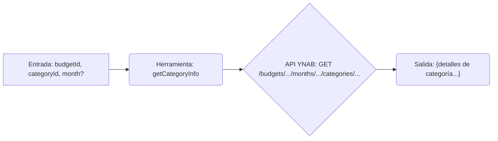

# Herramienta: getCategoryInfo

## Propósito y Contexto de Uso

Obtiene información detallada sobre una *única* categoría específica para un presupuesto y mes dados.

Esto es útil para verificar el estado específico (presupuestado, actividad, saldo, estado del objetivo) de una categoría. Típicamente requiere un `budgetId` (de `listBudgets`), un `categoryId` (de `listCategories`) y opcionalmente un `month`.

## Argumentos Clave

*   `budgetId` (string, requerido): El identificador del presupuesto que contiene la categoría.
*   `categoryId` (string, requerido): El identificador de la categoría específica a consultar.
*   `month` (string, opcional): El mes para obtener la información de la categoría (formato ISO 8601, p.ej., `YYYY-MM-DD`). Por defecto es el mes actual si no se proporciona.

## Salida Clave

Devuelve un único objeto que contiene información detallada sobre la categoría para el mes solicitado:

*   `name` (string): Nombre de la categoría.
*   `budgeted` (number): Cantidad presupuestada.
*   `activity` (number): Actividad de gasto.
*   `balance` (number): Saldo actual.
*   `goal_type` (string | null): Tipo de objetivo (si existe).
*   `goal_target` (number): Cantidad objetivo de la meta (si aplica).
*   `goal_percentage_complete` (number | null): Porcentaje de finalización del objetivo (si aplica).
*   `note` (string | null): Nota del usuario para la categoría.

*(Todas las cantidades monetarias están en formato milliunits).*

## Flujo Simplificado

