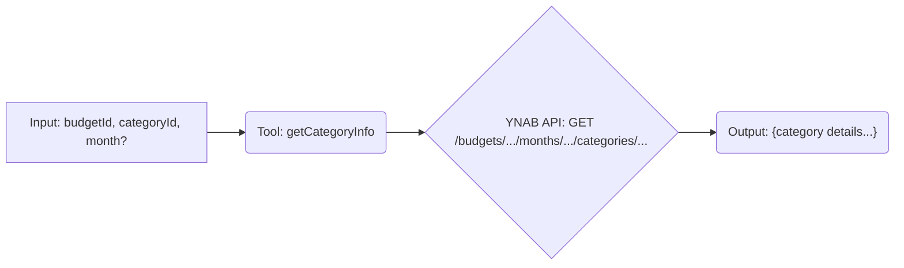

# Tool: getCategoryInfo

## Purpose & Usage Context

Fetches detailed information about a *single*, specific category for a given budget and month.

This is useful for checking the specific status (budgeted, activity, balance, goal status) of one category. It typically requires a `budgetId` (from `listBudgets`), a `categoryId` (from `listCategories`), and optionally a `month`.

## Key Arguments

*   `budgetId` (string, required): The identifier of the budget containing the category.
*   `categoryId` (string, required): The identifier of the specific category to query.
*   `month` (string, optional): The month to get category info for (ISO 8601 format, e.g., `YYYY-MM-DD`). Defaults to the current month if not provided.

## Key Output

Returns a single object containing detailed information about the category for the requested month:

*   `name` (string): Category name.
*   `budgeted` (number): Amount budgeted.
*   `activity` (number): Spending activity.
*   `balance` (number): Current balance.
*   `goal_type` (string | null): Type of goal (if any).
*   `goal_target` (number): Goal target amount (if applicable).
*   `goal_percentage_complete` (number | null): Goal completion percentage (if applicable).
*   `note` (string | null): User note for the category.

*(All currency amounts are in milliunits format).*

## Simplified Flow

