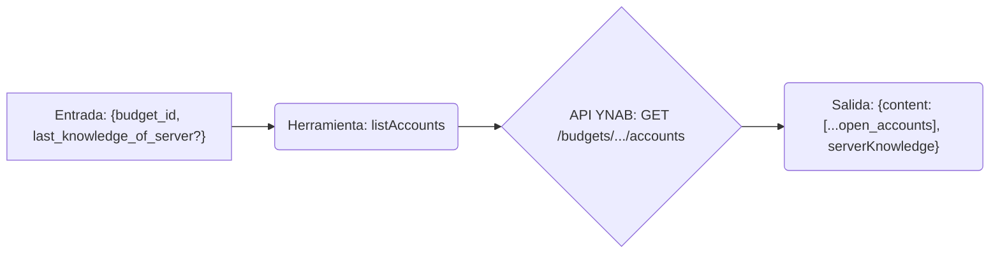

# Herramienta: listAccounts

## Propósito y Contexto de Uso

Obtiene una lista de cuentas asociadas a un presupuesto específico, excluyendo las cuentas cerradas por defecto. Es esencial para obtener los valores de `accountId` necesarios para otras herramientas como `getAccountBalance` o `createTransaction`. Admite solicitudes delta utilizando `last_knowledge_of_server` para obtener solo los cambios desde la última llamada para el presupuesto especificado.

## Argumentos Clave

*   `budget_id` (string, requerido): El ID del presupuesto para el cual listar las cuentas.
*   `last_knowledge_of_server` (number, opcional): El valor `serverKnowledge` devuelto por una llamada anterior para el *mismo presupuesto*. Si se proporciona, solo se devuelven los cambios desde ese punto.

## Salida Clave

Devuelve un objeto que contiene:

*   `content`: Un array de objetos de cuentas abiertas. Cada uno típicamente incluye `id`, `name`, `type`, `balance`, `cleared_balance`, `uncleared_balance` y el estado `deleted`.
*   `serverKnowledge` (number): El valor actual de conocimiento del servidor para las cuentas de este presupuesto. Pasa esto en `last_knowledge_of_server` en llamadas posteriores para el *mismo presupuesto*.

*(Consulta la documentación de la API de YNAB o el esquema de la herramienta para la lista completa de campos en cada objeto de cuenta). Filtra cuentas cerradas.*

## Flujo Simplificado

