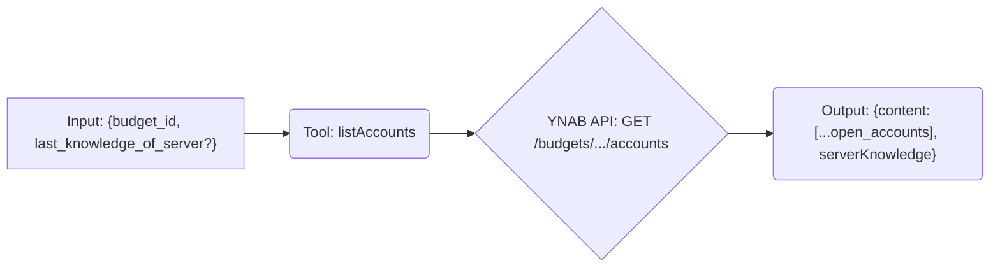

# Tool: listAccounts

## Purpose & Usage Context

Fetches a list of accounts associated with a specific budget, excluding closed accounts by default. This is essential for getting `accountId` values needed for other tools like `getAccountBalance` or `createTransaction`. It supports delta requests using `last_knowledge_of_server` to fetch only changes since the last call for the specified budget.

## Key Arguments

*   `budget_id` (string, required): The ID of the budget for which to list accounts.
*   `last_knowledge_of_server` (number, optional): The `serverKnowledge` value returned from a previous call for the *same budget*. If provided, only changes since that point are returned.

## Key Output

Returns an object containing:

*   `content`: An array of open account objects. Each typically includes `id`, `name`, `type`, `balance`, `cleared_balance`, `uncleared_balance`, and `deleted` status.
*   `serverKnowledge` (number): The current server knowledge value for this budget's accounts. Pass this in `last_knowledge_of_server` on subsequent calls for the *same budget*.

*(Refer to the YNAB API documentation or tool schema for the full list of fields in each account object). Filters closed accounts.*

## Simplified Flow

