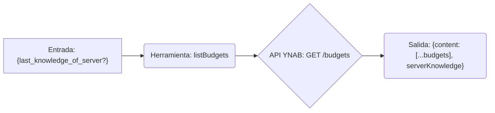

# Herramienta: listBudgets

## Propósito y Contexto de Uso

Obtiene una lista de presupuestos accesibles por el token de API. Este suele ser el primer paso para identificar el `budgetId` necesario para la mayoría de las otras herramientas específicas del presupuesto. Admite solicitudes delta utilizando `last_knowledge_of_server` para obtener solo los cambios desde la última llamada.

## Argumentos Clave

*   `last_knowledge_of_server` (number, opcional): El valor `serverKnowledge` devuelto por una llamada anterior. Si se proporciona, solo se devuelven los cambios desde ese punto.

## Salida Clave

Devuelve un objeto que contiene:

*   `content`: Un array de objetos de presupuesto, cada uno incluyendo típicamente `id`, `name` y `last_modified_on`.
*   `serverKnowledge` (number): El valor actual de conocimiento del servidor. Pasa esto en `last_knowledge_of_server` en llamadas posteriores.

*(Consulta la documentación de la API de YNAB o el esquema de la herramienta para la lista completa de campos en cada objeto de presupuesto).*

## Flujo Simplificado

