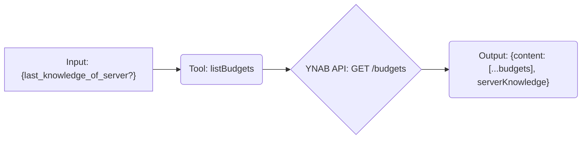

# Tool: listBudgets

## Purpose & Usage Context

Fetches a list of budgets accessible by the API token. This is typically the first step to identify the `budgetId` needed for most other budget-specific tools. It supports delta requests using `last_knowledge_of_server` to fetch only changes since the last call.

## Key Arguments

*   `last_knowledge_of_server` (number, optional): The `serverKnowledge` value returned from a previous call. If provided, only changes since that point are returned.

## Key Output

Returns an object containing:

*   `content`: An array of budget objects, each typically including `id`, `name`, and `last_modified_on`.
*   `serverKnowledge` (number): The current server knowledge value. Pass this in `last_knowledge_of_server` on subsequent calls.

*(Refer to the YNAB API documentation or tool schema for the full list of fields in each budget object).*

## Simplified Flow

