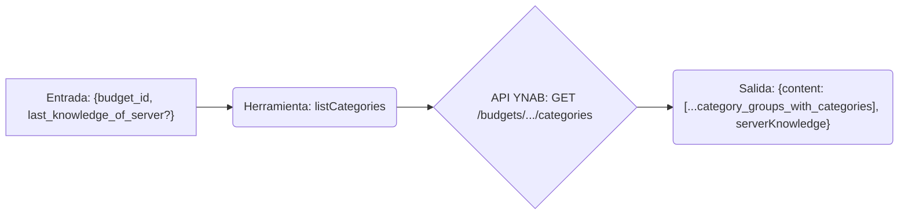

# Herramienta: listCategories

## Propósito y Contexto de Uso

Obtiene una lista de categorías asociadas a un presupuesto específico. Útil para obtener los valores de `categoryId` necesarios para otras herramientas como `getCategoryInfo` o `createTransaction`. Admite solicitudes delta utilizando `last_knowledge_of_server` para obtener solo los cambios desde la última llamada para el presupuesto especificado.

## Argumentos Clave

*   `budget_id` (string, requerido): El ID del presupuesto para el cual listar las categorías.
*   `last_knowledge_of_server` (number, opcional): El valor `serverKnowledge` devuelto por una llamada anterior para el *mismo presupuesto*. Si se proporciona, solo se devuelven los cambios desde ese punto.

## Salida Clave

Devuelve un objeto que contiene:

*   `content`: Un array de objetos de grupos de categorías, cada uno conteniendo un array de sus categorías. Las categorías típicamente incluyen `id`, `name`, `budgeted`, `activity`, `balance`, `goal_type` y el estado `deleted`.
*   `serverKnowledge` (number): El valor actual de conocimiento del servidor para las categorías de este presupuesto. Pasa esto en `last_knowledge_of_server` en llamadas posteriores para el *mismo presupuesto*.

*(Consulta la documentación de la API de YNAB o el esquema de la herramienta para la lista completa de campos. Nota la estructura anidada: los grupos contienen categorías).*

## Flujo Simplificado

