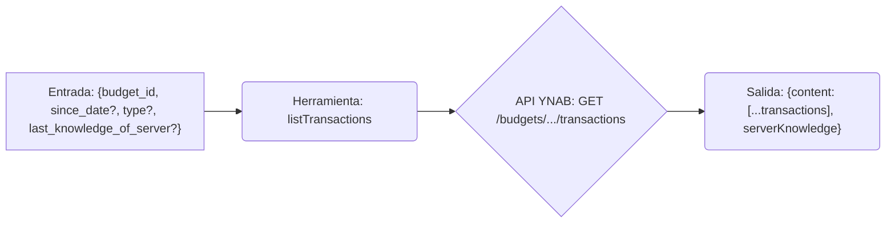

# Herramienta: listTransactions

## Propósito y Contexto de Uso

Obtiene una lista de transacciones para un presupuesto específico, con filtrado opcional por fecha (`since_date`) y tipo (`uncategorized` o `unapproved`). Admite solicitudes delta utilizando `last_knowledge_of_server` para obtener solo los cambios desde la última llamada *para el mismo presupuesto y condiciones de filtro*.

## Argumentos Clave

*   `budget_id` (string, requerido): El ID del presupuesto.
*   `since_date` (string, opcional): Recuperar transacciones en o después de esta fecha (`YYYY-MM-DD`).
*   `type` (string, opcional): Filtrar por tipo (`uncategorized` o `unapproved`).
*   `last_knowledge_of_server` (number, opcional): El valor `serverKnowledge` de una llamada anterior *con los mismos filtros*.

## Salida Clave

Devuelve un objeto que contiene:

*   `content`: Un array de objetos de transacción que coinciden con los criterios. Cada uno típicamente incluye `id`, `date`, `amount`, `memo`, `cleared`, `approved`, `account_id`, `payee_name`, `category_name`, etc.
*   `serverKnowledge` (number): El valor actual de conocimiento del servidor para los filtros especificados. Pasa esto en `last_knowledge_of_server` en llamadas posteriores *con los mismos filtros*.

*(Consulta la documentación de la API de YNAB o el esquema de la herramienta para la lista completa de campos en cada objeto de transacción).*

## Flujo Simplificado

