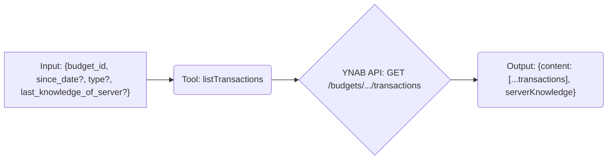

# Tool: listTransactions

## Purpose & Usage Context

Fetches a list of transactions for a specific budget, with optional filtering by date (`since_date`) and type (`uncategorized` or `unapproved`). It supports delta requests using `last_knowledge_of_server` to fetch only changes since the last call *for the same budget and filter conditions*.

## Key Arguments

*   `budget_id` (string, required): The ID of the budget.
*   `since_date` (string, optional): Retrieve transactions on or after this date (`YYYY-MM-DD`).
*   `type` (string, optional): Filter by type (`uncategorized` or `unapproved`).
*   `last_knowledge_of_server` (number, optional): The `serverKnowledge` value from a previous call *with the same filters*.

## Key Output

Returns an object containing:

*   `content`: An array of transaction objects matching the criteria. Each typically includes `id`, `date`, `amount`, `memo`, `cleared`, `approved`, `account_id`, `payee_name`, `category_name`, etc.
*   `serverKnowledge` (number): The current server knowledge value for the specified filters. Pass this in `last_knowledge_of_server` on subsequent calls *with the same filters*.

*(Refer to the YNAB API documentation or tool schema for the full list of fields in each transaction object).*

## Simplified Flow

